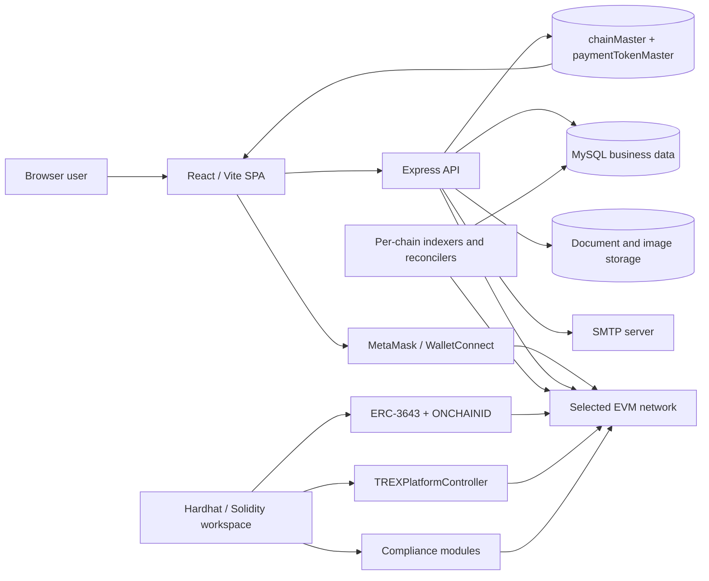

# T-REX Capital Market

A multichain capital-markets platform for compliant ERC-3643 (T-REX) token issuance, investor onboarding, wallet-executed transactions, and chain-specific reconciliation.

## Overview

T-REX Capital Market is a three-part application composed of a React/Vite web client, a Node.js/Express API backed by MySQL, and a Hardhat smart-contract workspace built around ERC-3643 and ONCHAINID.

The platform supports issuer and investor onboarding, organization KYB, investor KYC, document workflows, per-chain ONCHAINID creation, compliant token configuration and deployment, claims and Identity Registry registration, marketplace discovery, investment applications, invitations, purchases, transfers, redemptions, portfolios, canonical transaction history, administrative review, and chain/payment-token administration.

The backend is the single source of truth for supported networks and contract suites. The frontend loads active chains, public RPC metadata, platform contracts, implementation contracts, compliance modules, confirmation settings, and payment tokens from backend APIs whenever the selected network changes.

## Features

### Authentication and access control

- Email/password signup and login for Issuer and Investor accounts.
- One-time email verification through a POST confirmation flow with immediate JWT login.
- Forgot-password, reset-password, and resend-verification workflows through SMTP.
- Backend-issued JWT bearer tokens with role identity claims.
- Database-backed route permissions and role-based access control.
- External EVM wallet connection through MetaMask, WalletConnect, Wagmi, and Viem.
- Wallet uniqueness and cross-role checks that prevent one wallet from being reused as both an Investor and an Issuer.

### Issuer and organization workflows

- Organization/KYB profile management with draft, submit, reject, one-time revision, resubmit, and approval states.
- Jurisdiction, ISO country data, beneficial owners, wallet address, and institutional-document capture.
- Administrative organization review with rejection reasons and secure document preview/download.
- Chain-specific organization ONCHAINID creation before approval.
- Token creation covering metadata, optimized token images, claims, compliance rules, payment currency, governance roles, pricing, and deployment.
- Draft token chain changes while preserving deployed-token chain immutability.
- Chain-specific Platform Controller assignment as the default Token Agent for newly created tokens.
- Investor directory, invitations, investment application review, claims, Identity Registry registration, and redemption processing.
- Owner-only current-price updates without changing the immutable initial token price.

### Investor workflows

- Investor identity/KYC, compliance, suitability, accreditation, and document workflows.
- Per-chain ONCHAINID state with explicit network unlock support.
- Chain-filtered marketplace, invitations, interests, claims, holdings, portfolio, and transaction history.
- Identity Registry registration with backend transaction, event, and final-state verification.
- Wallet-executed investment, token transfer, and redemption flows.
- Canonical history recovered from chain events even when the browser does not report a transaction hash.
- Country-restriction filtering and compliant-token eligibility checks.

### Multichain blockchain and compliance

- ERC-3643 integration through `@erc3643org/erc-3643`.
- ONCHAINID integration through `@onchain-id/solidity`.
- `TREXPlatformController` for priced purchases and atomic redemptions.
- `IDFactoryAccessManager` as the backend entry point for chain-specific identity creation.
- Country-restriction, maximum-balance, and maximum-investor compliance modules.
- Database-backed chain and payment-token configuration.
- One `userChainIdentity` record per user and network.
- Browser-safe public chain configuration APIs with no private keys or internal RPC URLs.
- Chain-scoped reads and writes selected through `X-Chain-Uid` for authenticated Issuer and Investor requests.
- Per-chain checkpointed deployment, claim, Identity Registry, and canonical transaction indexers.
- Receipt, calldata, event, canonical-block, and final-state verification instead of trusting browser-submitted metadata.

### Operational capabilities

- Admin-only network and payment-token management APIs.
- Immutable chain IDs and contract suites after network creation.
- Editable public RPC URL, explorer URL, fallback internal RPC URLs, active state, and network image.
- Append-only `chainMasterAudit` records for network changes.
- Controller allowlist verification for database-backed payment tokens.
- MySQL persistence with explicit transactions and DB-backed worker leases.
- Health endpoints at `/api/health` and `/api/v1/health`.
- Helmet, exact CORS allowlisting, compression, rate limiting, request IDs, and normalized errors.
- Structured JSON logs with sensitive-value redaction and retention cleanup.
- Swagger UI, OpenAPI documentation, Postman collection, backend tests, frontend quality checks, and smart-contract tests.

## Technology Stack

| Area | Technologies |
| --- | --- |
| Frontend | React 19, Vite, React Router, TanStack Query, Axios, Zustand, React Hook Form, Zod, Tailwind CSS, Framer Motion, Lucide, Sonner |
| Wallet / Web3 client | Wagmi, Viem, MetaMask Connect, WalletConnect, Circle Bridge Kit |
| Authentication | Email verification, bcryptjs, JWT bearer authentication, SMTP |
| Backend | Node.js, Express 5, CommonJS, Joi |
| Database | MySQL 8+, `mysql2` |
| Blockchain | Solidity 0.8.17, Hardhat, Ethers v6, ERC-3643, ONCHAINID, OpenZeppelin Contracts 4.9 |
| File handling | Multer, Sharp, local filesystem storage, SHA-256 checksums |
| API documentation | Swagger UI, OpenAPI YAML, Postman collection |
| Security / middleware | Helmet, CORS, `express-rate-limit`, bcryptjs |
| Testing | Node.js `node:test`, Supertest, Hardhat test suite |

## Project Architecture

The repository contains three independently managed Node/npm workspaces; there is no root `package.json` or root orchestration script.

- **Frontend** is a React single-page application. It authenticates through the backend, loads chain configuration from backend APIs, connects the user's external wallet, initiates wallet-signed transactions, and presents Issuer, Investor, and Admin workflows.
- **Backend** owns identity and business data, authentication, RBAC, onboarding, documents, reviews, chain/payment-token configuration, transaction verification, indexing, reconciliation, notifications, audit data, and canonical history.
- **T-Rex** contains Solidity contracts, tests, deployment scripts, ERC-3643 artifacts, and versioned deployment manifests.

Transaction execution and application persistence are intentionally separated:

```text
Transaction execution:
User wallet -> selected-chain smart contract -> blockchain

Application history:
Blockchain events -> backend confirmation/indexers -> MySQL -> APIs -> frontend
```



### Major backend layers

| Layer | Responsibility |
| --- | --- |
| `api/v1` | Routes and controllers for authentication, chains, organizations, tokens, investors, investments, claims, and master data |
| `middleware` | Authentication, RBAC, selected-chain resolution, validation, uploads, CORS, rate limits, request IDs, and errors |
| `services` | Business workflows, chain runtime resolution, identity creation, receipt/event verification, indexing, files, email, and logging |
| `repositories` | Parameterized MySQL access and persistence |
| `schemas` | Joi validation for route parameters, queries, bodies, and multipart data |
| `jobs` | Per-chain synchronization, indexing, recovery, reconciliation, and expiry runners |
| `database` | Connection pool, transaction helpers, schema, migrations, and seed data |
| `dependencies` | Application composition for repositories, services, controllers, and jobs |

## Project Structure

```text
.
├── Backend/
│   ├── database/
│   │   ├── trex-capital-market.sql
│   │   ├── migrations/
│   │   ├── seed-admin-direct.sql
│   │   └── fix-linux-table-name-case.sql
│   ├── deployments/              # Backend migration/runtime deployment manifests
│   ├── docs/
│   │   └── openapi.yaml
│   ├── postman/
│   ├── public/logs/              # Runtime logs; not application source
│   ├── scripts/
│   ├── src/
│   │   ├── api/v1/
│   │   ├── core/
│   │   ├── database/
│   │   ├── dependencies/
│   │   ├── jobs/
│   │   ├── middleware/
│   │   ├── repositories/
│   │   ├── schemas/
│   │   ├── services/
│   │   └── server.js
│   ├── storage/                  # Runtime document/image storage
│   ├── tests/
│   └── package.json
├── Frontend/
│   ├── public/
│   ├── src/
│   │   ├── api/
│   │   ├── components/
│   │   ├── config/
│   │   ├── context/
│   │   ├── hooks/
│   │   ├── layouts/
│   │   ├── pages/
│   │   ├── services/
│   │   │   ├── blockchain/
│   │   │   └── wallet/
│   │   ├── store/
│   │   └── main.jsx
│   ├── .env.example
│   ├── vite.config.js
│   └── package.json
└── T-Rex/
    ├── contracts/
    │   ├── modules/
    │   ├── platform/
    │   └── mocks/
    ├── deployments/              # Versioned chain deployment manifests
    ├── scripts/
    ├── test/
    ├── hardhat.config.ts
    ├── .env.example
    └── package.json
```

`T-Rex/artifacts`, `T-Rex/cache`, and `T-Rex/typechain-types` are generated Hardhat outputs and are not primary source directories.

## Prerequisites

- **Node.js `>=22.22.1`** — satisfies the frontend requirement and the backend's Node.js `>=20` requirement.
- **npm `>=10`**.
- **MySQL 8+**.
- **SMTP credentials** for email verification and password reset.
- **WalletConnect/Reown project ID** for WalletConnect support.
- At least one active `chainMaster` row containing a verified contract suite, browser-safe public RPC, encrypted backend signer, confirmation settings, and scan boundaries.
- A stable `CHAIN_SECRET_ENCRYPTION_KEY` shared by every API/worker instance.
- Funded wallets appropriate to the configured chain operations.

## Installation

There is no root installer. Install each workspace independently.

### 1. Backend dependencies

```bash
cd Backend
npm ci
cp .env.example .env
```

Configure `.env` before starting the API. Chain-specific runtime values belong in `chainMaster`, not persistent environment variables.

### 2. Database initialization

```bash
mysql -u root -p < database/trex-capital-market.sql
npm run seed:locations
```

Create an administrator after configuring `ADMIN_FULL_NAME`, `ADMIN_EMAIL`, `ADMIN_PASSWORD`, and optionally `ADMIN_ROLE_UID`:

```bash
npm run seed:admin
```

Apply all required dated migrations for an existing installation before starting the current code.

### 3. Frontend dependencies

```bash
cd ../Frontend
npm ci
cp .env.example .env
```

The frontend environment contains only generic application/API/wallet-connector settings. It must not contain chain contract maps, platform addresses, deployer keys, or internal RPC endpoints.

### 4. Smart-contract workspace

```bash
cd ../T-Rex
npm ci
cp .env.example .env
npm run compile
npm test
```

## Environment Configuration

Never commit or publish secrets. JWT secrets, SMTP passwords, database credentials, the chain-secret encryption key, and deployment private keys must remain server-side. Every `VITE_*` value is browser-visible and must be treated as public.

### Backend required-at-startup variables

| Variable | Purpose |
| --- | --- |
| `DB_HOST`, `DB_PORT`, `DB_NAME`, `DB_USER`, `DB_PASSWORD` | MySQL connection |
| `JWT_SECRET` | JWT signing secret; use at least 32 high-entropy characters |
| `SMTP_HOST`, `SMTP_USER`, `SMTP_PASSWORD`, `SMTP_FROM_EMAIL` | Verification/reset email delivery |
| `CHAIN_SECRET_ENCRYPTION_KEY` | Encrypts/decrypts chain signer material stored in `chainMaster`; use at least 32 random characters |

### Backend configuration groups

| Area | Variables |
| --- | --- |
| Application | `NODE_ENV`, `PORT`, `APP_NAME`, `APP_VERSION`, `APP_BASE_URL`, `FRONTEND_URL` |
| Database | `DB_HOST`, `DB_PORT`, `DB_NAME`, `DB_USER`, `DB_PASSWORD`, `DB_CONNECTION_LIMIT` |
| JWT / auth | `JWT_SECRET`, `JWT_EXPIRY`, `ISSUER_ROLE_UID`, `INVESTOR_ROLE_UID`, `BCRYPT_ROUNDS`, `EMAIL_VERIFICATION_TOKEN_TTL_MINUTES`, `PASSWORD_RESET_TOKEN_TTL_MINUTES` |
| SMTP | `SMTP_HOST`, `SMTP_PORT`, `SMTP_SECURE`, `SMTP_USER`, `SMTP_PASSWORD`, `SMTP_FROM_NAME`, `SMTP_FROM_EMAIL` |
| HTTP security | `ALLOWED_ORIGINS`, `CORS_CREDENTIALS`, `RATE_LIMIT_WINDOW_MS`, `RATE_LIMIT_MAX`, `AUTH_RATE_LIMIT_MAX`, `TRUST_PROXY` |
| Logging | `LOG_LEVEL`, `LOG_RETENTION_DAYS` |
| Organization uploads | `UPLOAD_DIR`, `UPLOAD_MAX_FILE_SIZE_MB`, `UPLOAD_MAX_FILES` |
| Investor uploads | `INVESTOR_UPLOAD_DIR`, `INVESTOR_UPLOAD_MAX_FILE_SIZE_MB`, `INVESTOR_UPLOAD_MAX_FILES` |
| Token images | `TOKEN_IMAGE_UPLOAD_DIR`, `TOKEN_IMAGE_MAX_FILE_SIZE_MB`, `TOKEN_IMAGE_MIN_DIMENSION`, `TOKEN_IMAGE_MAX_DIMENSION`, `TOKEN_IMAGE_OPTIMIZED_MAX_DIMENSION`, `TOKEN_IMAGE_VIRUS_SCANNER_PATH`, `TOKEN_IMAGE_VIRUS_SCAN_TIMEOUT_MS` |
| Chain secrets | `CHAIN_SECRET_ENCRYPTION_KEY` |
| Off-chain workflow TTLs | `PURCHASE_INTENT_TTL_MINUTES`, `REDEMPTION_AUTHORIZATION_TTL_MINUTES`, `TRANSFER_INTENT_TTL_MINUTES` |
| Admin seed | `ADMIN_FULL_NAME`, `ADMIN_EMAIL`, `ADMIN_PASSWORD`, `ADMIN_ROLE_UID` |

RPC URLs, chain IDs, network names, contract addresses, signer keys, confirmation counts, start blocks, recovery ranges, and indexer enablement are database-backed chain configuration and must not be duplicated in the normal application environment.

### Safe backend `.env` example

```dotenv
NODE_ENV=development
PORT=3000
APP_NAME=T-REX Capital Market
APP_VERSION=1.0.0
APP_BASE_URL=http://localhost:3000
FRONTEND_URL=http://localhost:5173

DB_HOST=127.0.0.1
DB_PORT=3306
DB_NAME=trexCapitalMarket
DB_USER=<mysql-user>
DB_PASSWORD=<mysql-password>
DB_CONNECTION_LIMIT=10

JWT_SECRET=<at-least-32-random-characters>
JWT_EXPIRY=1h
BCRYPT_ROUNDS=12
EMAIL_VERIFICATION_TOKEN_TTL_MINUTES=1440
PASSWORD_RESET_TOKEN_TTL_MINUTES=30

SMTP_HOST=<smtp-host>
SMTP_PORT=587
SMTP_SECURE=false
SMTP_USER=<smtp-user>
SMTP_PASSWORD=<smtp-password>
SMTP_FROM_NAME=T-REX Capital Market
SMTP_FROM_EMAIL=<verified-sender@example.com>

ALLOWED_ORIGINS=http://localhost:5173
CORS_CREDENTIALS=true
RATE_LIMIT_WINDOW_MS=60000
RATE_LIMIT_MAX=100
AUTH_RATE_LIMIT_MAX=10

CHAIN_SECRET_ENCRYPTION_KEY=<at-least-32-random-characters>
```

### Frontend variables

| Area | Variables |
| --- | --- |
| Application/API | `VITE_APP_NAME`, `VITE_APP_VERSION`, `VITE_DEPLOYMENT_ENVIRONMENT`, `VITE_API_BASE_URL`, `VITE_API_VERSION`, `VITE_SOCKET_URL`, `VITE_REQUEST_TIMEOUT`, `VITE_USE_MOCK_API` |
| Product links | `VITE_COMPANY_NAME`, `VITE_COMPANY_WEBSITE_URL`, `VITE_COMPANY_WEBSITE_LABEL`, `VITE_CONTACT_US_URL`, `VITE_DOCUMENTS_URL`, `VITE_SUPPORT_EMAIL` |
| UI/build | `VITE_ENABLE_DARK_MODE`, `VITE_ENABLE_ANALYTICS`, `VITE_ENABLE_SOURCEMAPS`, `VITE_DEV_PORT`, `VITE_PREVIEW_PORT` |
| Optional integrations | `VITE_FIREBASE_API_KEY`, `VITE_SENTRY_DSN` |
| Wallet connection | `VITE_WALLETCONNECT_PROJECT_ID` |

### Safe frontend `.env` example

```dotenv
VITE_APP_NAME=T-REX Capital Market
VITE_APP_VERSION=1.0.0
VITE_DEPLOYMENT_ENVIRONMENT=testnet
VITE_API_BASE_URL=http://localhost:3000/api
VITE_API_VERSION=v1
VITE_REQUEST_TIMEOUT=500000
VITE_USE_MOCK_API=false
VITE_ENABLE_DARK_MODE=false
VITE_ENABLE_ANALYTICS=false
VITE_ENABLE_SOURCEMAPS=false
VITE_DEV_PORT=5173
VITE_PREVIEW_PORT=4173
VITE_WALLETCONNECT_PROJECT_ID=<public-walletconnect-project-id>
```

Supported networks come from `GET /api/v1/chains`. Browser-safe contract and payment-token data comes from `GET /api/v1/chains/:chainUid/config`. Do not add chain-specific addresses to `VITE_*` variables.

## Database

### Technology and conventions

- MySQL 8+ / InnoDB with `utf8mb4`.
- UTC session timestamps using `DATETIME(3)` patterns.
- `mysql2` connection pooling and application-layer transactions.
- Camel-case table identifiers; use the Linux case-normalization script after importing a Windows export when needed.
- Soft-delete fields across master and business records.
- Blockchain event identity based on `chainId + transactionHash + logIndex`.

### Important table groups

| Domain | Representative tables |
| --- | --- |
| Users / RBAC | `userRole`, `userMaster`, `menuMaster`, `permissionMaster`, `authToken` |
| Chains | `chainMaster`, `chainMasterAudit`, `paymentTokenMaster`, `userChainIdentity` |
| General/master data | `generalSettings`, `entityTypeMaster`, `industryMaster`, `documentTypeMaster`, `countryMaster`, `stateMaster`, `cityMaster` |
| Organizations | `organizationMaster`, `organizationBeneficialOwner`, `organizationDocument` |
| Token setup | `tokenMaster`, `tokenClaimTopic`, `tokenCountryRestriction`, `tokenDeploymentAttempt` |
| Investor onboarding | `investorMaster`, `investorInvestmentCategory`, `investorDocumentTypeMaster`, `investorDocument` |
| Investment workflow | `tokenInvestmentInterest`, `tokenInvestmentInterestHistory`, `investmentSubmissionDocument`, `investorInvitation` |
| Claims / identity | `issuerClaimVerification`, `issuerClaimSignature`, `investorClaimSubmission`, `investorClaimBlockchainEvent`, `identityRegistryRegistration`, `identityRegistryBlockchainEvent` |
| Canonical chain history | `blockchainTransaction`, `blockchainIndexerCheckpoint` |
| Legacy/audit flow data | `tokenPurchase`, `tokenRedemption`, `tokenTransfer` and their history/event tables |

### Database scripts

```bash
# Base schema
mysql -u root -p < Backend/database/trex-capital-market.sql

# Reference locations
cd Backend
npm run seed:locations

# Administrator account after ADMIN_* configuration
npm run seed:admin

# Development-only test accounts
npm run seed:test-users
```

Use dated migrations for existing environments. Back up the database before applying schema or deployment migrations.

## Running the Project

### Backend development

```bash
cd Backend
npm run dev
```

### Backend production process

```bash
cd Backend
npm run check
npm test
npm start
```

### Frontend development

```bash
cd Frontend
npm run dev
```

Environment-specific commands are also available:

```bash
npm run dev:testnet
npm run dev:mainnet
npm run build:testnet
npm run build:mainnet
```

### Frontend production build

```bash
npm run lint
npm run format:check
npm run build
```

### Smart-contract development

```bash
cd T-Rex
npm run compile
npm test
```

## API Documentation

### Base URLs

| Service | Default local URL |
| --- | --- |
| Backend API | `http://localhost:3000/api/v1` |
| Swagger UI | `http://localhost:3000/api-docs` |
| Frontend | `http://localhost:5173` |

### Health endpoints

```http
GET /api/health
GET /api/v1/health
```

### Authentication header

```http
Authorization: Bearer <access-token>
```

Authenticated Issuer and Investor calls under chain-scoped modules also send:

```http
X-Chain-Uid: <selected-chain-uid>
```

### Current route inventory

#### Health and API documentation

| Method | Route | Purpose |
| --- | --- | --- |
| `GET` | `/api/health` | Return the API health status |
| `GET` | `/api/v1/health` | Return the versioned API health status |
| `GET` | `/api-docs` | Open the Swagger UI |

#### Authentication

| Method | Route | Purpose |
| --- | --- | --- |
| `POST` | `/api/v1/auth/signup` | Create an Issuer or Investor account |
| `POST` | `/api/v1/auth/verify-email` | Verify a one-time token and return the normal JWT session |
| `POST` | `/api/v1/auth/resend-verification` | Send a replacement link when eligible |
| `POST` | `/api/v1/auth/login` | Password login |
| `POST` | `/api/v1/auth/forgot-password` | Request a password-reset email |
| `GET` | `/api/v1/auth/verify-reset-token` | Validate a reset token |
| `POST` | `/api/v1/auth/reset-password` | Set a replacement password |

#### Chains and payment tokens

| Method | Route | Purpose |
| --- | --- | --- |
| `GET` | `/api/v1/chains` | List active public networks |
| `GET` | `/api/v1/chains/:chainUid/config` | Return browser-safe network, contracts, confirmations, and payment tokens |
| `GET` | `/api/v1/chains/:chainUid/image` | Return the network image |
| `GET` | `/api/v1/chains/me` | Return the authenticated user's per-chain identity/unlock state |
| `POST` | `/api/v1/chains/:chainUid/unlock` | Create/recover the user's ONCHAINID for that network |
| `GET` | `/api/v1/payment-tokens` | List active Controller-allowlisted payment tokens for a chain |
| `GET` | `/api/v1/payment-tokens/:paymentTokenUid/image` | Return the payment-token image |

#### Admin network management

| Method | Route | Purpose |
| --- | --- | --- |
| `GET` | `/api/v1/admin/chains` | List networks |
| `POST` | `/api/v1/admin/chains` | Create a network and validate its contract suite |
| `GET` | `/api/v1/admin/chains/:chainUid` | Read a network configuration |
| `PATCH` | `/api/v1/admin/chains/:chainUid` | Update permitted network fields |
| `PUT` | `/api/v1/admin/chains/:chainUid/image` | Replace a network image |
| `GET` | `/api/v1/admin/chains/:chainUid/audits` | Read append-only network change history |
| `GET` | `/api/v1/admin/payment-tokens` | List payment tokens |
| `POST` | `/api/v1/admin/payment-tokens` | Create a payment token |
| `GET` | `/api/v1/admin/payment-tokens/:paymentTokenUid` | Read a payment token |
| `PATCH` | `/api/v1/admin/payment-tokens/:paymentTokenUid` | Update permitted payment-token fields |
| `PUT` | `/api/v1/admin/payment-tokens/:paymentTokenUid/image` | Replace a payment-token image |
| `DELETE` | `/api/v1/admin/payment-tokens/:paymentTokenUid` | Deactivate or remove a payment-token record |

Network delete is intentionally unavailable. Networks are enabled or disabled so historical records remain resolvable. Contract suites and chain IDs are immutable after creation.

#### Public reference data

| Method | Route | Purpose |
| --- | --- | --- |
| `GET` | `/api/v1/token-options` | Return token-creation reference options for the selected chain |
| `GET` | `/api/v1/locations/countries` | List countries |
| `GET` | `/api/v1/locations/countries/:countryUid/states` | List states for a country |
| `GET` | `/api/v1/locations/states/:stateUid/cities` | List cities for a state |
| `GET` | `/api/v1/organization-options` | Return organization onboarding options |
| `GET` | `/api/v1/investor-options` | Return investor onboarding options |
| `GET` | `/api/v1/general-settings/public` | Return public application settings |

#### Organization and KYB

| Method | Route | Purpose |
| --- | --- | --- |
| `GET` | `/api/v1/organizations/me` | Return the authenticated issuer's organization for the selected chain |
| `PATCH` | `/api/v1/organizations/me/user-notified` | Mark the organization notification as seen |
| `PUT` | `/api/v1/organizations/me/company-information` | Save company information |
| `PUT` | `/api/v1/organizations/me/jurisdiction` | Save jurisdiction information |
| `PUT` | `/api/v1/organizations/me/beneficial-owners` | Save beneficial owners |
| `POST` | `/api/v1/organizations/me/documents` | Upload organization documents |
| `GET` | `/api/v1/organizations/me/documents` | List organization documents |
| `GET` | `/api/v1/organizations/me/documents/:documentUid/download` | Download an organization document |
| `DELETE` | `/api/v1/organizations/me/documents/:documentUid` | Delete an organization document |
| `POST` | `/api/v1/organizations/me/submit` | Submit or resubmit an organization application |

#### Admin organization review

| Method | Route | Purpose |
| --- | --- | --- |
| `GET` | `/api/v1/admin/organizations` | List organization applications |
| `GET` | `/api/v1/admin/organizations/:organizationUid` | Return complete organization details |
| `PATCH` | `/api/v1/admin/organizations/:organizationUid/status` | Approve or reject an organization application |
| `GET` | `/api/v1/admin/organizations/:organizationUid/documents/:documentUid/file` | Preview or download an organization document |

#### Token configuration and deployment

| Method | Route | Purpose |
| --- | --- | --- |
| `GET` | `/api/v1/tokens/me` | Return the authenticated issuer's token for the selected chain |
| `PUT` | `/api/v1/tokens/me/information` | Save token information and image |
| `GET` | `/api/v1/tokens/me/image` | Return the token image |
| `PUT` | `/api/v1/tokens/me/claims` | Save claim-topic configuration |
| `PUT` | `/api/v1/tokens/me/compliance` | Save compliance rules |
| `PUT` | `/api/v1/tokens/me/governance` | Save governance roles |
| `PATCH` | `/api/v1/tokens/me/price` | Update the current token price |
| `POST` | `/api/v1/tokens/me/deployment-attempts` | Create a token deployment attempt |
| `GET` | `/api/v1/tokens/me/deployment-attempts/active` | Return the active deployment attempt |
| `PATCH` | `/api/v1/tokens/me/deployment-attempts/:deploymentAttemptUid/submitted` | Record a submitted deployment transaction |
| `PATCH` | `/api/v1/tokens/me/deployment-attempts/:deploymentAttemptUid/fail` | Mark a deployment attempt as failed |
| `POST` | `/api/v1/tokens/me/submit` | Verify and finalize a deployed token |

#### Investor profile and KYC

| Method | Route | Purpose |
| --- | --- | --- |
| `GET` | `/api/v1/investors/me` | Return the authenticated investor profile for the selected chain |
| `PUT` | `/api/v1/investors/me/identity` | Save investor identity details |
| `PUT` | `/api/v1/investors/me/compliance` | Save investor compliance details |
| `POST` | `/api/v1/investors/me/documents` | Upload investor documents |
| `GET` | `/api/v1/investors/me/documents` | List investor documents |
| `GET` | `/api/v1/investors/me/documents/:documentUid/download` | Download an investor document |
| `DELETE` | `/api/v1/investors/me/documents/:documentUid` | Delete an investor document |
| `POST` | `/api/v1/investors/me/submit` | Submit the investor profile |

#### Canonical blockchain transactions

| Method | Route | Purpose |
| --- | --- | --- |
| `POST` | `/api/v1/investments/transactions/confirm` | Independently verify and record a frontend-submitted transaction hash |
| `GET` | `/api/v1/investments/transactions` | List chain-specific canonical transaction history |
| `GET` | `/api/v1/investments/transactions/export` | Export filtered canonical transaction history |

#### Marketplace, purchase, transfer, and portfolio

| Method | Route | Purpose |
| --- | --- | --- |
| `GET` | `/api/v1/investments/tokens` | List marketplace tokens available to the investor |
| `GET` | `/api/v1/investments/tokens/:tokenUid` | Return marketplace token details |
| `GET` | `/api/v1/investments/tokens/:tokenUid/image` | Return a marketplace token image |
| `GET` | `/api/v1/investments/tokens/:tokenUid/transfers` | List legacy transfer history for a token |
| `GET` | `/api/v1/investments/transfers/:transferUid` | Return a legacy transfer record |
| `GET` | `/api/v1/investments/tokens/:tokenUid/purchases` | List legacy purchase history for a token |
| `GET` | `/api/v1/investments/purchases/:purchaseUid` | Return a legacy purchase record |
| `GET` | `/api/v1/investments/me/portfolio` | Return the investor's chain-specific portfolio |
| `GET` | `/api/v1/investments/tokens/:tokenUid/required-documents` | Return documents required to apply for a token |

#### Investment interests and invitations

| Method | Route | Purpose |
| --- | --- | --- |
| `POST` | `/api/v1/investments/tokens/:tokenUid/interest` | Submit an investment interest |
| `GET` | `/api/v1/investments/me/interests` | List the investor's interests |
| `GET` | `/api/v1/investments/me/interests/:interestUid/history` | Return investor-visible interest history |
| `GET` | `/api/v1/investments/me/invitations` | List issuer invitations received by the investor |
| `GET` | `/api/v1/investments/me/invitations/:invitationUid` | Return an invitation and related token details |
| `PATCH` | `/api/v1/investments/me/invitations/:invitationUid/viewed` | Mark an invitation as viewed |
| `GET` | `/api/v1/investments/issuer/investors` | List completed investor profiles available to an issuer |
| `POST` | `/api/v1/investments/issuer/investors/:investorUid/invitations` | Invite an investor to a token |
| `GET` | `/api/v1/investments/issuer/interests` | List investment interests for the issuer |
| `GET` | `/api/v1/investments/issuer/interests/:interestUid` | Return an investment interest |
| `POST` | `/api/v1/investments/issuer/interests/:interestUid/approve` | Approve an investment interest |
| `POST` | `/api/v1/investments/issuer/interests/:interestUid/reject` | Reject an investment interest |
| `GET` | `/api/v1/investments/issuer/interests/:interestUid/history` | Return issuer-visible interest history |
| `GET` | `/api/v1/investments/issuer/interests/:interestUid/documents/:documentUid/download` | Download an investor application document |

#### Identity Registry registration

| Method | Route | Purpose |
| --- | --- | --- |
| `POST` | `/api/v1/investments/issuer/interests/:interestUid/registry-registration` | Create or recover a pending registration operation |
| `GET` | `/api/v1/investments/issuer/interests/:interestUid/registry-registration` | Return the registration operation |
| `POST` | `/api/v1/investments/issuer/interests/:interestUid/registry-registration/:registryRegistrationUid/confirm` | Independently verify and confirm the registration transaction |

#### Redemptions

| Method | Route | Purpose |
| --- | --- | --- |
| `POST` | `/api/v1/investments/tokens/:tokenUid/redemptions` | Create an investor redemption request |
| `GET` | `/api/v1/investments/tokens/:tokenUid/redemptions` | List the investor's token redemption requests |
| `GET` | `/api/v1/investments/redemptions/:redemptionUid` | Return an investor redemption request |
| `POST` | `/api/v1/investments/redemptions/:redemptionUid/authorize` | Record investor authorization for the request |
| `POST` | `/api/v1/investments/redemptions/:redemptionUid/cancel` | Cancel an eligible redemption request |
| `GET` | `/api/v1/investments/issuer/redemptions` | List issuer redemption requests |
| `GET` | `/api/v1/investments/issuer/redemptions/:redemptionUid` | Return an issuer redemption request |
| `POST` | `/api/v1/investments/issuer/redemptions/:redemptionUid/approve` | Approve a redemption request |
| `POST` | `/api/v1/investments/issuer/redemptions/:redemptionUid/reject` | Reject a redemption request |

#### Issuer claims

| Method | Route | Purpose |
| --- | --- | --- |
| `POST` | `/api/v1/issuer/claims/sign` | Sign investor claims |
| `GET` | `/api/v1/issuer/claims/:subscriptionId` | Return issuer claim status for a subscription |

#### Investor claims

| Method | Route | Purpose |
| --- | --- | --- |
| `GET` | `/api/v1/investor/claims` | List claims for the authenticated investor |
| `POST` | `/api/v1/investor/claims/:claimId/prepare` | Prepare an on-chain claim submission |
| `POST` | `/api/v1/investor/claims/:claimId/retry` | Reconcile or retry an existing claim submission |
| `POST` | `/api/v1/investor/claims/:claimId/submit` | Submit a claim transaction hash for verification |

#### User administration

| Method | Route | Purpose |
| --- | --- | --- |
| `POST` | `/api/v1/users` | Create a user |
| `GET` | `/api/v1/users` | List users |
| `GET` | `/api/v1/users/:userUid` | Return a user |
| `PUT` | `/api/v1/users/:userUid` | Update a user |
| `DELETE` | `/api/v1/users/:userUid` | Delete or deactivate a user |

#### Role administration

| Method | Route | Purpose |
| --- | --- | --- |
| `POST` | `/api/v1/roles` | Create a role |
| `GET` | `/api/v1/roles` | List roles |
| `GET` | `/api/v1/roles/:roleUid` | Return a role |
| `PUT` | `/api/v1/roles/:roleUid` | Update a role |
| `DELETE` | `/api/v1/roles/:roleUid` | Delete or deactivate a role |

#### Menu administration

| Method | Route | Purpose |
| --- | --- | --- |
| `POST` | `/api/v1/menus` | Create a menu |
| `GET` | `/api/v1/menus` | List menus |
| `GET` | `/api/v1/menus/:menuUid` | Return a menu |
| `PUT` | `/api/v1/menus/:menuUid` | Update a menu |
| `DELETE` | `/api/v1/menus/:menuUid` | Delete or deactivate a menu |

#### Permission administration

| Method | Route | Purpose |
| --- | --- | --- |
| `POST` | `/api/v1/permissions` | Create a permission |
| `GET` | `/api/v1/permissions` | List permissions |
| `GET` | `/api/v1/permissions/:permissionUid` | Return a permission |
| `PUT` | `/api/v1/permissions/:permissionUid` | Update a permission |
| `DELETE` | `/api/v1/permissions/:permissionUid` | Delete or deactivate a permission |

#### General-settings administration

| Method | Route | Purpose |
| --- | --- | --- |
| `POST` | `/api/v1/general-settings` | Create a setting |
| `GET` | `/api/v1/general-settings` | List settings |
| `GET` | `/api/v1/general-settings/:settingUid` | Return a setting |
| `PUT` | `/api/v1/general-settings/:settingUid` | Update a setting |
| `DELETE` | `/api/v1/general-settings/:settingUid` | Delete or deactivate a setting |

Refer to the OpenAPI source and Postman collection for the full request and response contracts.

### Request examples

#### Signup

```http
POST /api/v1/auth/signup
Content-Type: application/json
```

```json
{
  "fullName": "Example User",
  "email": "user@example.com",
  "password": "<strong-password>",
  "isIssuer": false
}
```

#### Verify email and create a session

```http
POST /api/v1/auth/verify-email
Content-Type: application/json
```

```json
{
  "token": "<one-time-email-verification-token>"
}
```

The response contains the same `accessToken`, token metadata, and user session shape as normal login.

### Response conventions

Successful responses use:

```json
{
  "success": true,
  "message": "Operation completed",
  "data": {},
  "timestamp": "<UTC ISO timestamp>",
  "requestId": "<request-id>"
}
```

Errors use:

```json
{
  "success": false,
  "message": "Request failed",
  "error": {
    "code": "<stable-error-code>",
    "details": {}
  },
  "timestamp": "<UTC ISO timestamp>",
  "requestId": "<request-id>"
}
```

### Swagger / OpenAPI / Postman

- Swagger UI: `GET /api-docs`
- OpenAPI source: `Backend/docs/openapi.yaml`
- Postman collection: `Backend/postman/Trex Capital Market Backend.postman_collection.json`

## Authentication & Authorization

### Issuer / Investor signup flow

1. The user submits `fullName`, `email`, `password`, and `isIssuer` to `/auth/signup`.
2. The backend creates the inactive/unverified account and sends a one-time email link.
3. The link opens the frontend verification page.
4. The user confirms through `POST /auth/verify-email`.
5. The backend validates and consumes the token, marks the account verified, and returns a JWT session.
6. The user connects an external wallet when an onboarding or blockchain action requires it.

### Issuer / Investor login flow

1. `POST /auth/login` validates email and password.
2. The backend confirms that the user, role, and email-verification state are active.
3. The backend returns the normal JWT session.
4. Wallet connection is handled separately and does not replace backend authentication.

### JWT and route authorization

JWTs include the authenticated user and role identifiers. Protected routes verify the token and then resolve route permissions from the database. Role or permission changes therefore take effect without rebuilding the frontend.

### Password reset

`forgot-password` creates an opaque reset token, stores only its hash, applies the configured TTL, and sends the reset link through SMTP. `verify-reset-token` checks the token and `reset-password` consumes it.

## Blockchain / Web3

### Backend-driven multichain runtime

`chainMaster` is the runtime source of truth for:

- Chain identity and display metadata.
- Native currency details.
- Public and fallback RPC URLs.
- Explorer URL and network image.
- Complete platform and implementation contract suites.
- Encrypted backend signer and public deployer address.
- Confirmation counts, scan start blocks, recovery ranges, and indexer switches.

The frontend first calls `GET /api/v1/chains`, stores the selected `chainUid`, then calls `GET /api/v1/chains/:chainUid/config`. Every network switch replaces the active wallet chain, contract clients, payment-token list, and chain-scoped query cache.

### Per-chain ONCHAINID

Each user can have one ONCHAINID per supported chain. The first identity is created during onboarding. Additional networks are unlocked through `POST /api/v1/chains/:chainUid/unlock`.

The backend signer calls the selected chain's `IDFactoryAccessManager`, which delegates identity creation to the configured Identity Factory. The backend checks the Identity Factory before and after the transaction and records factory address, identity address, transaction evidence, status, and unlock state in `userChainIdentity`.

### ERC-3643 / ONCHAINID

The application uses the official ERC-3643 and ONCHAINID packages. The database tracks workflow state and indexed evidence, while executed on-chain state remains authoritative.

### Custom contracts

#### `TREXPlatformController.sol`

The Platform Controller provides:

- Owner-managed payment-token configuration.
- Issuer-controlled token pricing.
- Pause/unpause controls.
- Atomic purchase settlement.
- Atomic redemption that burns investor tokens and transfers the selected payment token from Issuer to Investor.
- Allowance, balance, Token Agent, and reentrancy checks.
- Buy/redeem quote helpers and settlement events.

#### Compliance modules

- **`CountryRestrictModule`** — enforces configured ISO 3166-1 numeric geographic rules; an empty country list means no geographic restriction.
- **`MaxBalanceModule`** — enforces an absolute maximum token balance per investor.
- **`MaxInvestorsModule`** — enforces a maximum number of distinct holders.

### Payment tokens

Payment currencies are linked to a chain through `paymentTokenMaster`. Public APIs return only active database tokens that are also present in the selected Platform Controller's current on-chain payment-token list. Purchase and redemption verification uses the selected token's chain, address, symbol, and decimals.

### Transaction model

- **Invest:** the Investor approves the selected payment token when required and signs the Controller purchase transaction. The backend validates the resulting receipt/events and indexes canonical history.
- **Transfer:** the Investor signs the ERC-3643 token transfer. The contract enforces registry, compliance, pause, freeze, and holding rules; the backend observes and indexes the event.
- **Redemption:** the Investor creates an off-chain request. After Issuer review and sufficient payment-token allowance, the Issuer signs the Controller redemption transaction. The contract burns Investor tokens and transfers payment atomically; the backend verifies and indexes it.
- **Claims and registry:** backend-authoritative workflow records are combined with wallet-signed chain actions and backend receipt/event/state verification.

The optional fast confirmation endpoint improves UI responsiveness, but indexers remain responsible for recovering transactions missed because of a browser refresh, network failure, or backend outage.

## Background Jobs / Workers

The backend loads every active chain and runs chain-specific jobs sequentially to avoid RPC bursts. A failure on one chain is logged and does not stop processing on other chains.

| Job | Purpose |
| --- | --- |
| TREX deployment synchronization | Recovers token deployments missed by the interactive flow |
| Claim recovery | Repairs incomplete investor claim submissions |
| Global claim indexer | Indexes `ClaimAdded` and `ClaimChanged` across known per-chain ONCHAINIDs |
| Identity Registry reconciliation | Indexes registration events and reconciles pending registration operations |
| Canonical transaction indexer | Indexes confirmed INVEST, TRANSFER, and REDEMPTION activity |
| Expiry/recovery runners | Expire abandoned intents and reconcile incomplete workflow records where applicable |

Canonical checkpoints are keyed by indexer and chain ID. Checkpoints advance only after a range is processed successfully. Confirmed records store chain ID, block number, block hash, transaction hash, and log index for idempotency and reorganization checks.

## File Uploads / Storage

### Organization and investor documents

- Randomized stored filenames.
- Configurable size and file-count limits.
- PDF, PNG, JPG, and JPEG validation.
- SHA-256 checksums.
- Controlled download endpoints.
- Workflow-aware replacement and deletion.

### Token, chain, and payment-token images

- Raster signature/decoding checks rather than extension trust.
- PNG, JPEG, WebP, and screened SVG input support where configured.
- Configurable size and dimension limits.
- Optimized metadata-free WebP output for token images.
- Randomized storage keys and traversal-safe serving.
- Optional external virus scanner support.

Production deployments should use persistent encrypted storage or replace the local storage adapter.

## Error Handling & Logging

### HTTP/security middleware

- Helmet security headers.
- Exact CORS origin allowlisting.
- Compression and JSON/body size limits.
- Global API and stricter authentication rate limits.
- Optional trusted-proxy handling.
- Request ID propagation.
- Standardized application, validation, authentication, database, and upload errors.

### Logging

The backend writes structured JSON records to dated folders under:

```text
Backend/public/logs/YYYY-MM-DD/
```

Sensitive keys are redacted, but production logs must still be treated as confidential operational data and forwarded to controlled centralized storage.

### Health checks

Use `GET /api/health` for a lightweight process health response. Startup validates environment configuration and database connectivity before accepting normal traffic.

## Testing

### Backend

```bash
cd Backend
npm run check
npm test
```

Tests cover authentication, organizations, investors, tokens, chain administration, payment tokens, claims, registry operations, purchases, transfers, redemptions, canonical transaction verification, and indexer/recovery behavior.

### Smart contracts

```bash
cd T-Rex
npm run compile
npm test
```

### Frontend

```bash
cd Frontend
npm run lint
npm run format:check
npm run build
```

## API / Development Tools

### Backend scripts

```text
npm start              # node src/server.js
npm run dev            # nodemon src/server.js
npm run check          # JavaScript syntax check
npm test               # node --test tests/**/*.test.js
npm run seed:admin     # create/update the administrator account
npm run seed:locations # load country/state/city reference data
npm run seed:test-users
npm run chain:bootstrap # one-time legacy-chain secret migration only
```

### Frontend scripts

```text
npm run dev
npm run dev:testnet
npm run dev:mainnet
npm run build
npm run build:testnet
npm run build:mainnet
npm run preview
npm run lint
npm run lint:fix
npm run format
npm run format:check
```

Husky/lint-staged configuration is present for local Git workflow support.

### Smart-contract scripts

```text
npm run compile
npm test
npm run deploy:compliance-modules
npm run deploy:platform-controller
npm run wire:platform-controller
npm run phase0:deploy-platform
npm run phase0:redeploy-factory
npm run deploy:id-factory-access-manager
npm run deploy:chain
npm run verify:chain
npm run verify:idfactory
npm run verify:all
npm run sync:erc3643-artifacts
npm run diagnose:transfer
```

## Deployment Addresses

Deployment addresses are versioned in the repository rather than duplicated in this README. Open the manifest for the required chain:

### Mainnet
- [Arc Mainnet](T-Rex/deployments/arc.json)
- [Arbitrum Mainnet](T-Rex/deployments/arbitrum.json)
- [Robinhood Mainnet](T-Rex/deployments/robinhood.json)

Each JSON manifest records the network, chain ID, deployment time, deployer, platform contracts, compliance modules, IDFactoryAccessManager, supported payment tokens, and implementation addresses for that deployment.

## Security Considerations

- **Secrets:** keep `JWT_SECRET`, `CHAIN_SECRET_ENCRYPTION_KEY`, SMTP/database credentials, and all private keys in server-side secret management. Never expose them through `VITE_*` or public APIs.
- **Chain signer storage:** chain signer keys are AES-256-GCM encrypted in `chainMaster`; public endpoints never return encrypted or decrypted signer material.
- **Password hashing:** configure a production-appropriate `BCRYPT_ROUNDS` value.
- **JWT:** use a high-entropy secret and rotate it through a controlled production process.
- **Email verification:** login sessions are issued only after one-time token validation and active user/role checks.
- **Wallet separation:** wallets are normalized and cannot be reused across conflicting Issuer/Investor identities.
- **Authorization:** protected routes combine JWT authentication with database-backed permission checks.
- **Selected-chain boundary:** authenticated chain-specific operations require `X-Chain-Uid`, and transaction confirmation rejects chain mismatches.
- **Frontend configuration:** contract addresses and payment tokens come from the backend selected-chain API; no private or internal chain data belongs in frontend configuration.
- **Blockchain verification:** a submitted hash is never sufficient by itself. The backend validates the expected chain, contract, sender, calldata, receipt, events, canonical block, and final state where required.
- **Indexer idempotency:** event identity uses chain ID, transaction hash, and log index; checkpointing and confirmation thresholds reduce duplicate and reorg risk.
- **Admin chain changes:** chain IDs and contract suites are immutable after creation. Mutable network changes are appended to `chainMasterAudit`.
- **CORS and rate limits:** use exact production origins and a shared limiter store when horizontally scaling.
- **Uploads and logs:** use persistent encrypted storage, strict permissions, backups, retention policies, and centralized monitoring.

## Troubleshooting

### Backend exits immediately with environment errors

Verify database, JWT, SMTP, and `CHAIN_SECRET_ENCRYPTION_KEY` values. Chain-specific RPCs and contracts must exist in `chainMaster`; they are not normal application environment variables.

### Database connection fails

Check `DB_HOST`, `DB_PORT`, `DB_NAME`, `DB_USER`, and `DB_PASSWORD`. The server pings MySQL before listening.

### Browser receives CORS errors

Add the exact frontend origin to `ALLOWED_ORIGINS`. Scheme, host, and port must match the browser origin.

### Frontend calls the wrong API path

For local development:

```dotenv
VITE_API_BASE_URL=http://localhost:3000/api
VITE_API_VERSION=v1
```

### A chain-specific API returns `SELECTED_CHAIN_REQUIRED`

Send the selected active chain UID in `X-Chain-Uid`. On every network switch, refresh `/chains/:chainUid/config`, switch the wallet to the returned chain ID, and invalidate old chain-scoped frontend queries.

### Chain unlock or identity creation fails

Confirm the selected chain is active and has valid public/internal RPCs, an encrypted funded backend signer, `identityFactoryAddress`, and `idFactoryAccessManagerAddress`. The Access Manager must authorize the configured backend signer.

### Network creation fails contract validation

Confirm the RPC supports the required JSON-RPC calls without restrictive batch limits, every supplied address has deployed bytecode on the submitted chain, the chain ID matches, and the payment-token list exactly matches the Platform Controller allowlist.

### Payment tokens are missing

The public response is the intersection of active `paymentTokenMaster` rows and the selected Controller's on-chain payment-token list. Check both sources and RPC availability.

### Blockchain indexers do not advance

Check the selected chain's active/indexer flags, RPC health, start blocks, confirmation thresholds, contract addresses, checkpoints, leases, and structured logs. A failure on one chain does not stop the other active chains.

### Token image upload is rejected

Check MIME type, actual decoded format, dimensions, file-size settings, SVG screening, and the optional virus scanner configuration.
